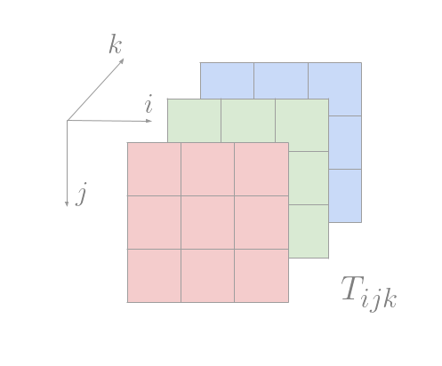

# tensor

[Tensor algebra](https://en.wikipedia.org/wiki/Tensor_algebra) library in a single header file in C11 for `graphics programming`, `machine and deep learning` and `physics`.



* Vectors, matrices, rank 3 and higher rank tensors.

* Linear algebra and tensor algebra operations.

* Pure C code, easy to integrate in C++ or other languajes using bindings.

* Only one header file.

Take a look at [tensor wiki](https://github.com/MorcilloSanz/tensor/wiki) for reading the docs.

## Transform vector example
```c
Matrix* matrix = create_indentity(4);
set_value(matrix, 2.0, 0, 3);
set_value(matrix, 3.0, 1, 3);
set_value(matrix, 4.0, 2, 3);

Vector* vector = create_vector(4);
set_value(vector, 1.0, 0);
set_value(vector, 1.0, 1);
set_value(vector, 1.0, 2);
set_value(vector, 1.0, 3);

transform(vector, matrix);
print_vector(vector);

destroy_tensor(matrix);
destroy_tensor(vector);
```

## Inverse of a matrix example
```c
Matrix* matrix = create_indentity(4);
set_value(matrix, 2.0, 0, 3);
set_value(matrix, 3.0, 1, 3);
set_value(matrix, 4.0, 2, 3);

Matrix* inv = inverse(matrix);
matmul(matrix, inv);
print_matrix(matrix);

destroy_tensor(matrix);
destroy_tensor(inv);
```

## Tensor product example
```c
Matrix* A = create_indentity(3);
set_value(A, 3.0, 1, 1);

Matrix* B = create_indentity(2);
product_scalar(B, 2.0);

Tensor* product = tensor_product(A, B);
print_tensor_rank4(product);

destroy_tensor(A);
destroy_tensor(B);
destroy_tensor(product);
``` 